# Создание SQL-запросов

## Запросы к таблице Customers  

1. Показать клиентов, живущих в одном городе, и сам город  
     

2. Показать клиентов (id, имя страна) из Германии и Финляндии. Данные сгруппировать по id  
     

3. Вывести количество стран, клиенты из которых есть в базе  
     

## Запросы к таблице Categories 

1. Вывести данные по категории, описание которой начинается с "Soft drinks"  
     

2. Вывести категорию, имеющую самое длинное описание, при этом CategoryName, переименованную в "Название", и Description, переименованное в "Описание"  
     

3. Вывести категории, название которых начинается на букву "С"  
      

## Запросы к таблице Employees

1. Показать фамилию и дату рождения самого взрослого сотрудника. Переименовать столбцы "LastName" в "Фамилия"  и "BirthDate" в "Самый взрослый" соответственно.
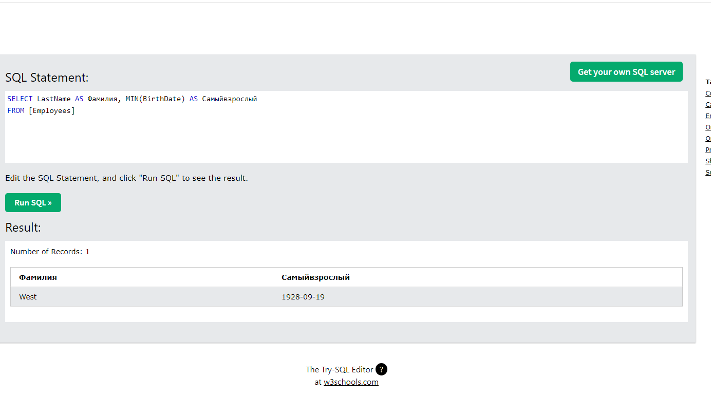  

1. Показать ID сотрудника и имена, которые начинаются на "An"
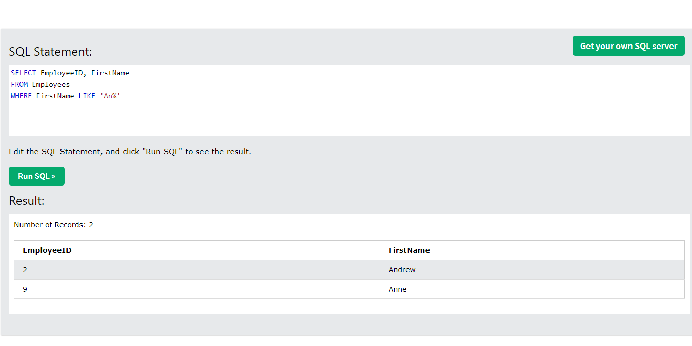

1. Показать сотрудников у которые номер ID  больше 5
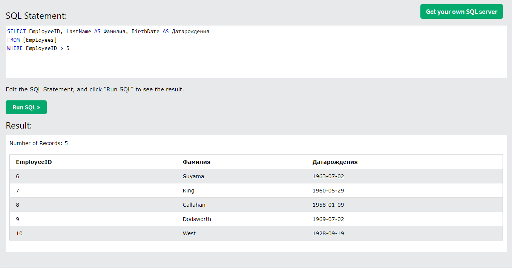

## Запросы к таблице OrderDetail

1. Показать заказы ID которых находятся в промежутке между 10250 и 10255   
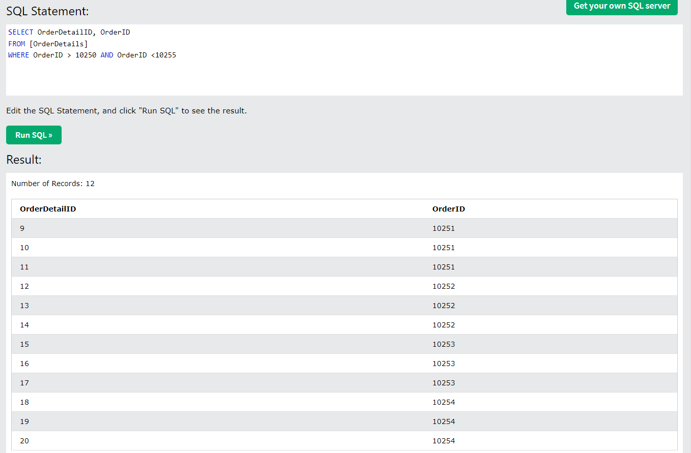

2. Показать заказы, Id которых в промежутке между 10250 и 10270, а количество меньше 10. Переименовать "OrderID" в "Заказ", "ProductID" в "IDПродукт", "Quantity" в "Количество"
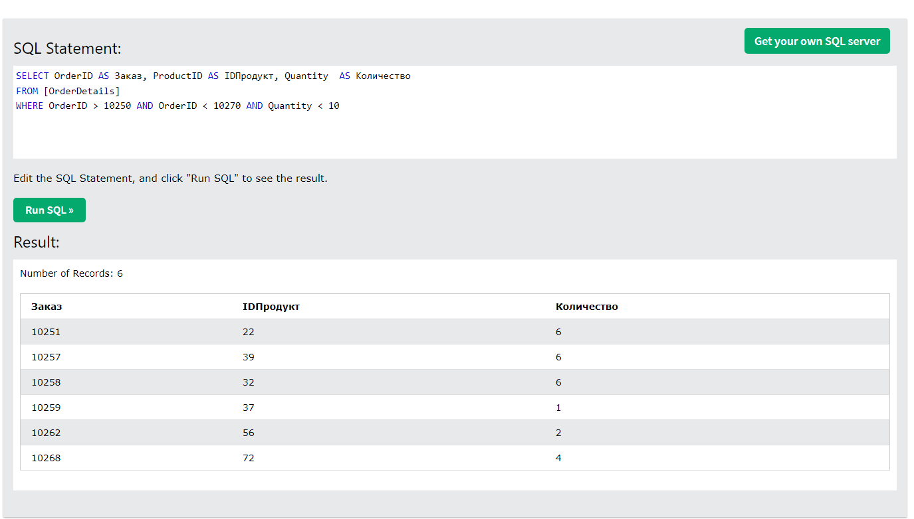

3. Показать ID заказ с максимальным количеством товаров. Переименовать столбец "Quantity" в " MAXQuantity"
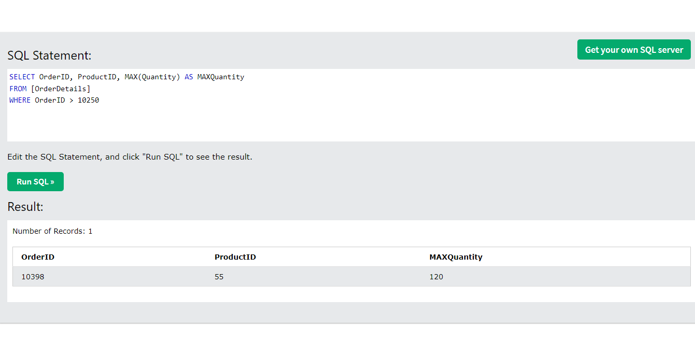

## Запросы к таблице Orders

1. Показать даты заказов клиента с id "63" 

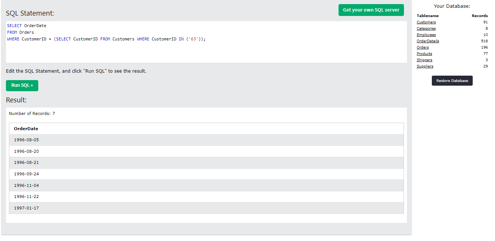

2. Отсортировать таблицу Orders от меньшего CustomerID к большему и от меньшей даты заказа к большей 

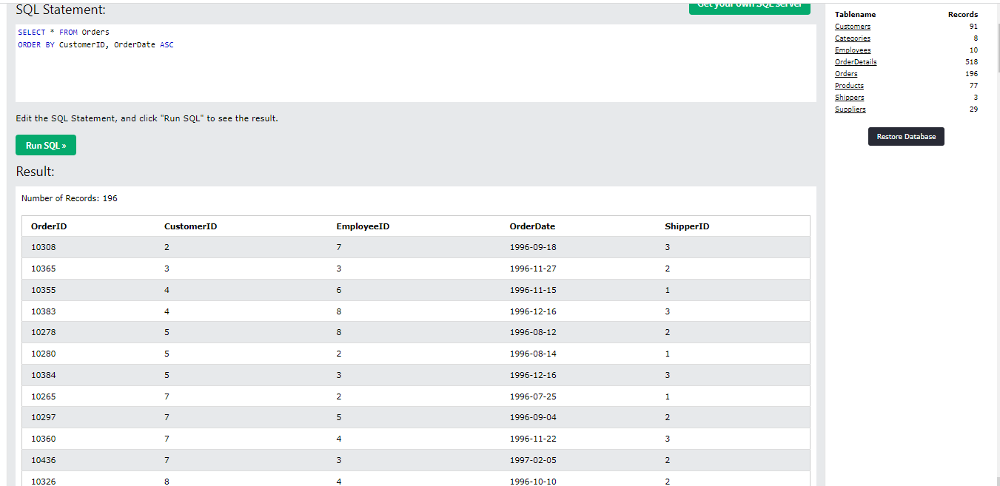

3. Показать количество заказов каждого клиента 

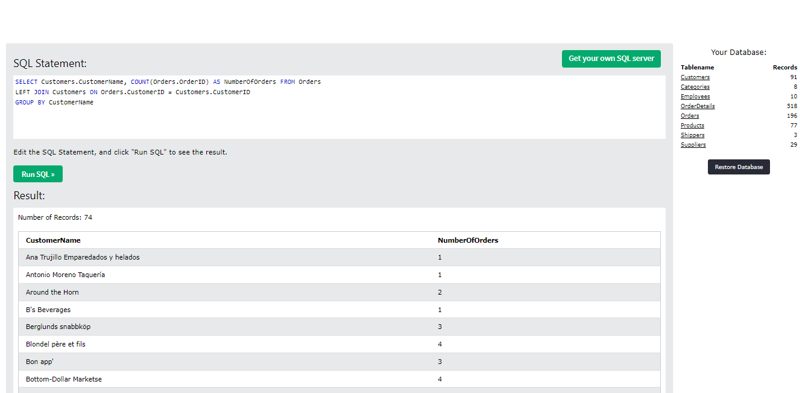

## Запросы к таблице Products

1. Показать сумму цен всех продуктов

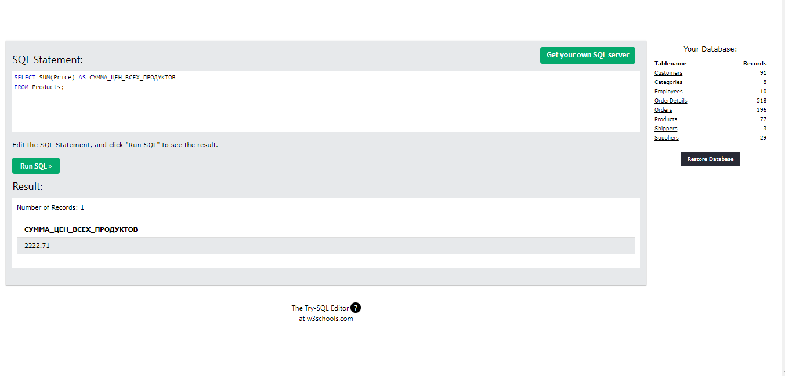

2. Показать города, из которых поставляются определенные продукты

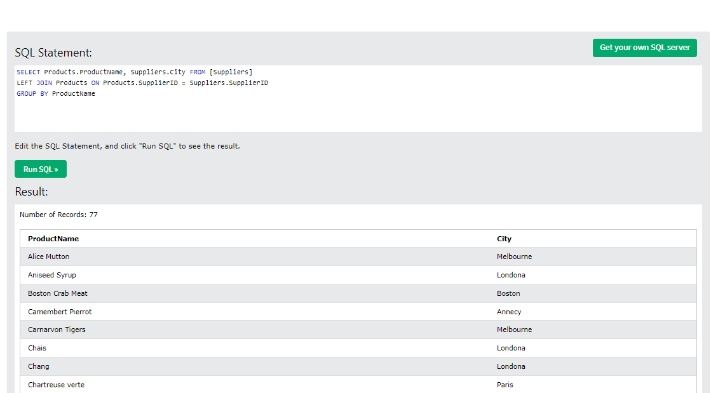

3. Показать стоимость всех заказов определенного продукта, округленную до 2-ух знаков после запятой

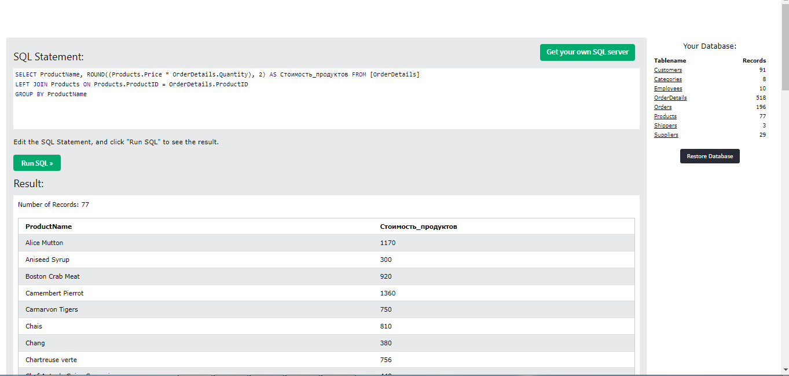

## Запросы к таблице Shippers

1. Показать грузоотправителей с номером телефона (503)555-9831.
   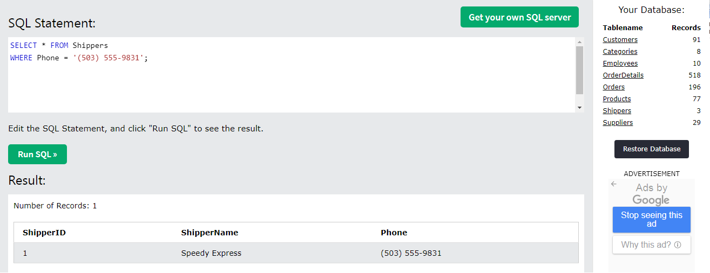

2. Показать грузоотправителей из id с номерами 1 и 2 и названием "United Package".
   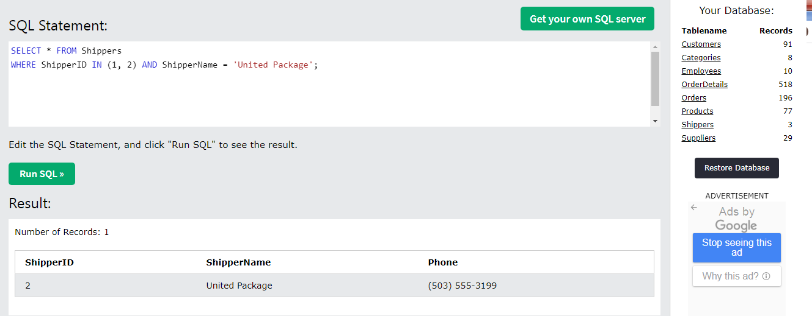

3. Показать грузоотправителей с id больше 1, сгруппировать по алфавиту.
   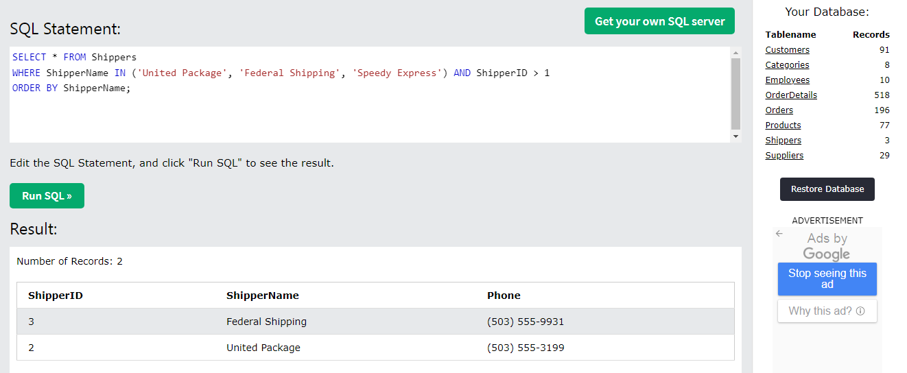

## Запросы к таблице Suppliers

1. Показать поставщиков с id больше 20. Исключить поставщиков из Канады и Франции.
   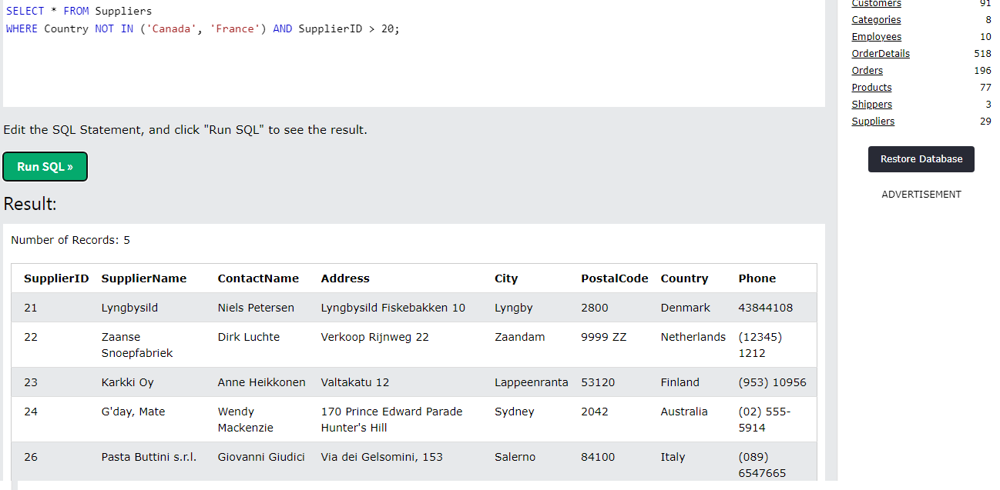

2. Показать города Германии, где есть поставщики, по алфавиту.
   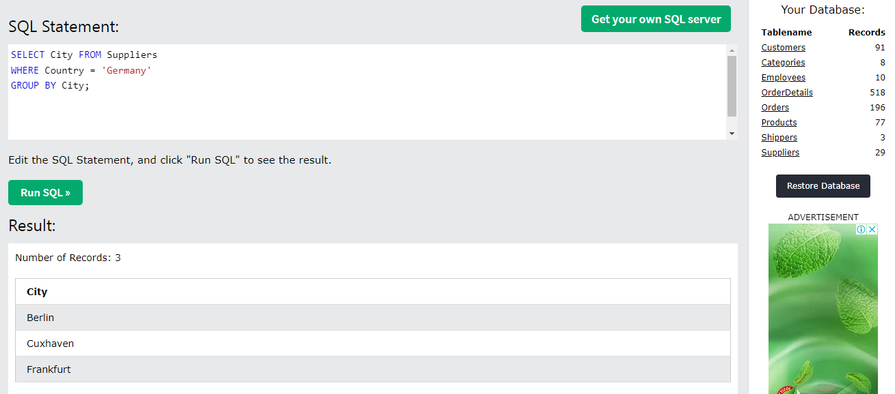

3. Группировка количества поставщиков по стране и городу.
   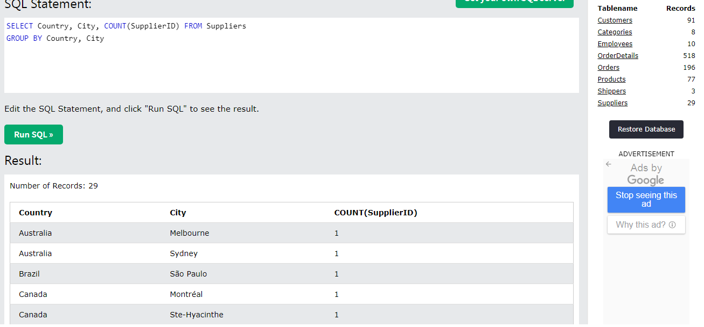
